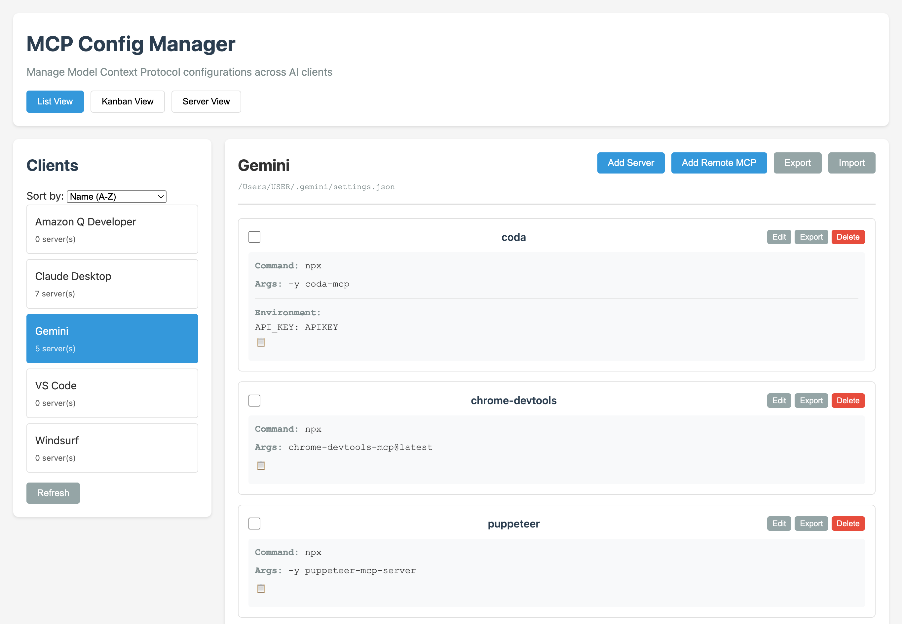
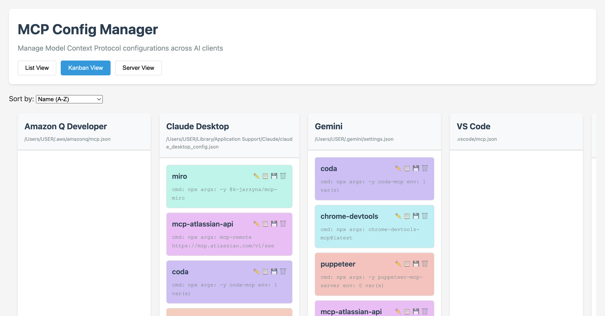
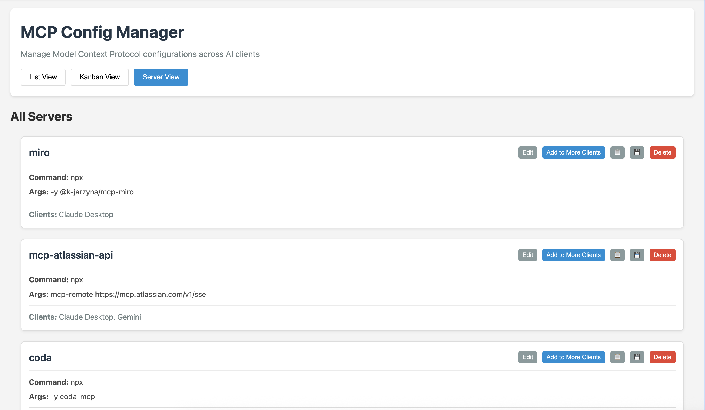
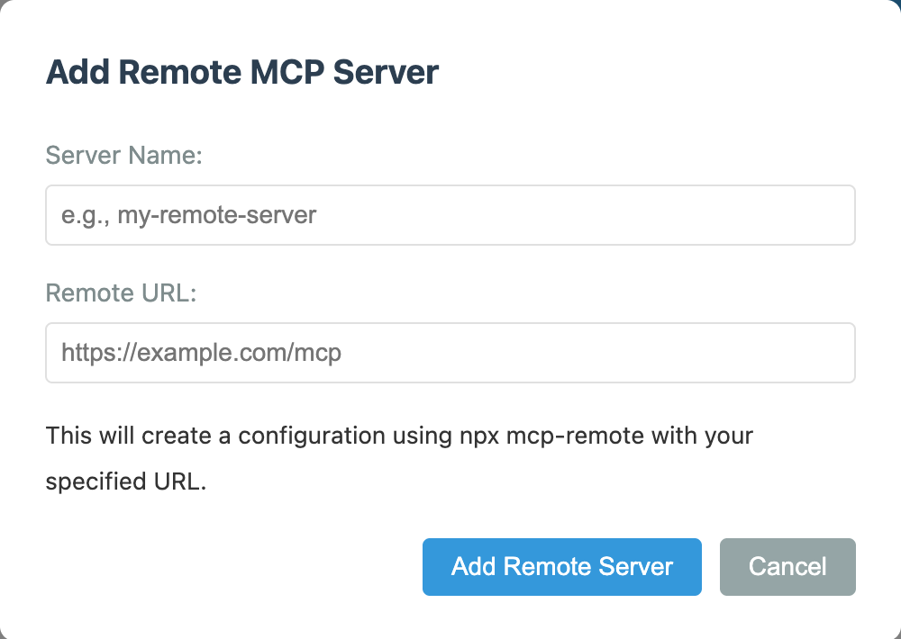

# MCP Config Manager

[](https://badge.fury.io/js/mcp-config-manager)

Simple CLI and web UI tool to manage Model Context Protocol (MCP) configurations across multiple AI clients.

## Features

- **Auto-detection**: Automatically discovers supported clients with existing MCP configuration files.
- **Multi-client support**: Manage configs for a growing list of clients, including Claude, VS Code, Cursor, Windsurf, Gemini, and more. The tool can detect any client that follows the MCP specification.
- **Simple CLI**: Command-line interface for quick operations
- **Web UI**: Clean web interface with List and Kanban views
- **Remote MCP Support**: Easy setup for remote MCP servers with just a name and URL
- **Kanban Board**: Drag-and-drop servers between clients
- **JSON Editor**: Edit server configs as raw JSON or using forms
- **Bulk Operations**: Copy servers to multiple clients at once
- **Clipboard Support**: Quick copy server configs to clipboard
- **Cross-platform**: Works on macOS, Windows, and Linux
- **Import/Export**: Share configurations between clients and users
- **Environment variables**: Easily manage API keys and settings

## Screenshots

### List View

*Traditional interface with detailed server management, showing individual client configurations with checkboxes for bulk operations.*

### Kanban View

*Drag-and-drop interface displaying servers as cards organized by client, with visual icons for quick actions.*

### Server View

*Consolidated view of all servers showing which clients each server is configured for, with bulk management options.*

### Remote MCP Setup

*Simple interface for adding remote MCP servers - just provide a name and URL to automatically generate the correct configuration.*

## Installation

```bash
# Install globally from npm
npm install -g mcp-config-manager
```

Alternatively, you can clone the project and run it locally:

```bash
# Clone or download the project
cd mcp-config-manager

# Install dependencies
npm install

# Make CLI globally available (optional)
npm link
```

## Usage

### CLI Commands

```bash
# List all clients and their status
mcp-manager list

# Show servers for a specific client
mcp-manager show claude

# Add a new server
mcp-manager add claude my-server -c npx -a "-y" "@example/server" -e API_KEY=abc123

# Remove a server from one client
mcp-manager remove claude my-server

# Remove a server from ALL clients
mcp-manager remove all my-server

# Copy server between clients
mcp-manager copy claude my-server cursor

# Copy server to ALL other clients
mcp-manager copy claude my-server all

# Manage environment variables
mcp-manager env claude my-server set API_KEY new-value
mcp-manager env claude my-server unset API_KEY
mcp-manager env claude my-server list

# Export/Import configurations
mcp-manager export claude config.json
mcp-manager export claude --server my-server server-config.json
mcp-manager import cursor config.json

# Start web UI
mcp-manager web
# or
npm run web
```

### Web UI

#### Development (when cloning repository)
```bash
npm run web
```

#### Global Installation
After installing globally with `npm install -g mcp-config-manager`:

**Start web server in foreground:**
```bash
mcp-config-manager web --port 3456
```

**Start web server as background daemon:**
```bash
mcp-config-manager start --port 3456
```

**Check daemon status:**
```bash
mcp-config-manager status
```

**Stop daemon:**
```bash
mcp-config-manager stop
```

Then open http://localhost:3456 in your browser.

The web UI provides:
- **Client auto-discovery**: Automatically detects clients with existing configurations on startup, with a refresh button to scan for more.
- **List View**: Traditional interface with detailed server management
  - Multi-select checkboxes for bulk delete operations
  - Remove from all clients button for each server
  - Bulk action toolbar with select all/none options
- **Kanban View**: Drag-and-drop servers between clients
  - Full functionality on cards (edit, copy, export, delete)
  - Visual icons for quick actions
  - Drag to copy servers between clients
- **Server View**: Consolidated view of all servers across clients
  - Shows which clients each server is configured for
  - Bulk operations to add servers to multiple clients
- **Remote MCP Support**: Dedicated "Add Remote MCP" button for easy setup
  - Simply provide server name and remote URL
  - Automatically generates `npx mcp-remote [URL]` configuration
  - Perfect for connecting to hosted MCP services
- **JSON Editor**: Toggle between form and raw JSON editing
- **Multi-select Copy**: Copy servers to multiple clients at once
- **Clipboard Support**: Quick copy server configs with one click
- **Config Path Display**: See where each client's config file is located
- Visual overview of all clients
- Add/edit/delete servers
- Import/export configurations
- Environment variable management

## Supported Clients

This tool supports auto-detection of any client that follows the Model Context Protocol specification. The following is a non-exhaustive list of clients that have been tested and are known to work:

- **Amazon Q Developer**: `~/.aws/amazonq/mcp.json`
- **Claude Desktop**: `~/Library/Application Support/Claude/claude_desktop_config.json`
- **Claude Code**: `.mcp.json` in project root
- **Cline**: `~/Library/Application Support/Code/User/globalStorage/saoudrizwan.claude-dev/settings/cline_mcp_settings.json`
- **Cursor**: `.cursor/mcp.json` (project-specific) or `~/.cursor/mcp.json` (global)
- **Factory Bridge**: `~/Library/Application Support/Factory Bridge/mcp.json`
- **Gemini**: `~/.gemini/settings.json`
- **Roo Code**: `~/Library/Application Support/Code/User/globalStorage/rooveterinaryinc.roo-cline/settings/cline_mcp_settings.json`
- **VS Code**: `.vscode/mcp.json`
- **Windsurf**: `~/.codeium/windsurf/mcp_config.json` or `~/AppData/Roaming/WindSurf/mcp_settings.json` (Windows)

*Note: Paths may vary based on your operating system. The tool will attempt to find the correct path automatically.*

## Configuration Format

Standard MCP server configuration:
```json
{
  "mcpServers": {
    "server-name": {
      "command": "npx",
      "args": ["-y", "@example/mcp-server"],
      "env": {
        "API_KEY": "your-key-here"
      }
    }
  }
}
```

## Security Note

Environment variables may contain sensitive data like API keys. The tool masks values containing "KEY" or "SECRET" in the display but stores them in plain text in config files.

## Development & Testing

### Running Tests

The project includes comprehensive test coverage:

```bash
# Run all tests (CLI + UI)
npm test

# Run CLI tests only (17 tests)
npm run test:cli

# Run UI tests only (2 tests) - requires Playwright
npm run test:ui

# Run specific test file
npx mocha test/ui-simple.test.js --timeout 30000
```

### Test Coverage

- **CLI Tests**: 17/17 ✅ - Comprehensive command-line functionality testing
- **UI Tests**: 2/2 ✅ - Frontend integration and API communication testing
- **Integration Tests**: End-to-end dual-mode form/JSON editing validation

### Development Setup

```bash
# Install dependencies (includes Playwright for UI testing)
npm install

# Install Playwright browsers (for UI tests)
npx playwright install chromium

# Start development server with mock data
MCP_USE_MOCK_CLIENTS=true npm run web

# Run server on custom port
PORT=3457 npm run web
```

### Testing with Mock Clients

For development and testing, you can use mock clients:

```bash
# Enable mock client mode
export MCP_USE_MOCK_CLIENTS=true

# Start server (will use test clients instead of real ones)
npm run web
```

This allows testing functionality without affecting real MCP client configurations.

## License

MIT